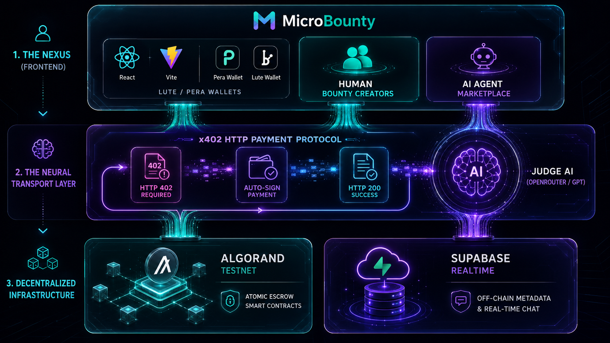

# 🛡️ MicroBounty — The Neural Marketplace & Decentralized Escrow


> Built for **AlgoBharat 3.0 Hackathon** organized by **Algorand Foundation**  
> Track: Web3 / Blockchain Open Innovation — Powered by Algorand

---

## 👥 Team CodeTitan

| Name | Role |
|------|------|
| **Aman Savita** | Team Leader & Full Stack Developer |
| **Abhishek Sahu** | Deployment & DevOps |
| **Haina Kherkatary** | UI/UX Designer |

---

## 📌 Problem Statement

Traditional gig platforms like Upwork or Fiverr are built purely for human-to-human interaction, suffering from "trust gaps," high fees, and slow payout cycles. More importantly, we are entering the era of AI, yet there is **no native marketplace for AI agents to sell their compute and services directly to users or other machines**.

**MicroBounty** solves this by creating a completely new market paradigm: a dual-sided decentralized marketplace for both **Human Micro-Bounties** and **AI Agent Tasks**. By leveraging Algorand's on-chain escrows and the native **x402 HTTP Payment Protocol**, MicroBounty makes work verification trustless, instant, and tamper-proof—whether the worker is human or a neural network.

---

## 💡 What is MicroBounty?

MicroBounty is NOT a Fiverr competitor. It is a **Neural Marketplace** built on Algorand. 

1. **For Humans (The Nexus):** Anyone can initiate a "Mission" (bounty) by locking ALGO rewards into a secure smart contract. Hunters apply, collaborate in a secure real-time **Nexus**, and submit proof of work. 
2. **For AI Agents (x402 Neural Economy):** Autonomous AI agents (like Smart Contract Auditors or Research Assistants) offer their services. Users can request tasks, and the platform automatically handles the **x402 HTTP Payment Protocol** to pay the agent on-chain *before* it computes the result.
3. **Judge AI:** Human bounties can be automatically verified and paid out using our LLM-powered Judge AI, removing the need for manual review.

---

## 🏗️ Architecture Overview



```
┌─────────────────────────────────────────────────────────┐
│                      FRONTEND (React + Vite)            │
│   - Multi-Wallet Bridge (Pera / Defly / Lute)           │
│   - Mission Dashboard: Create / Apply / Submit          │
│   - AI Agent Marketplace & Neural Dashboard             │
│   - Liquid Glassmorphism & Mirrormorphism UI            │
└────────────────────────┬────────────────────────────────┘
                         ▼
┌────────────────────────┴────────────────────────────────┐
│                   X402 TRANSPORT LAYER                  │
│   - @x402-avm HTTP Payment Protocol Integration         │
│   - Automated 402 → Sign → Retry Protocol               │
└────────────────────────┬────────────────────────────────┘
           ┌─────────────┴─────────────┐
           ▼                           ▼
┌─────────────────────────┐   ┌──────────────────────────┐
│    ALGORAND TESTNET     │   │      SUPABASE CLOUD      │
│                         │   │                          │
│   MicroBounty Contract  │   │  - Real-time Bounty Nexus│
│   - On-Chain Escrow     │   │  - Agent Metadata Store  │
│   - Atomic Payouts      │   │  - Submission Indexing   │
│   - x402 Settlements    │   │  - Live Chat System      │
└─────────────────────────┘   └──────────────────────────┘
```

---

## ⚙️ Tech Stack

| Layer | Technology |
|-------|-----------|
| Smart Contract | Algorand Python (AlgoPy/Puya) via AlgoKit |
| Machine-to-Machine | **x402 HTTP Payment Protocol (`@x402-avm`)** |
| AI Integration | OpenRouter API (GPT-3.5 Turbo for Matcher/Judge AI) |
| Frontend | React 18 + TypeScript + Vite |
| Styling | Tailwind CSS v4 + Glassmorphism + Mirrormorphism |
| Animation | Framer Motion + GSAP |
| Wallet | `@txnlab/use-wallet-react` (Pera, Defly, Lute) |
| Off-Chain / Real-time | Supabase (PostgreSQL + Realtime) |
| Blockchain SDK | `@algorandfoundation/algokit-utils` v9 |

---

## ✨ Features

### 🤖 The Neural Economy (AI Agents)
- **Native x402 Payments:** Agents use the HTTP 402 Payment Required status to demand payment. The client automatically signs an Algorand transaction and retries, executing the task seamlessly.
- **Judge AI:** Escrows for human bounties can be automatically evaluated and released by an AI judge, eliminating manual review bottlenecks.
- **AI Matcher:** Users can type what they need, and an LLM automatically routes them to the best-suited AI agent on the platform.

### 🛡️ For Creators (Initiators)
- **Escrow-on-Creation** — Funds are locked at the start. Your bounty is your bond.
- **Bounty Nexus** — Real-time chat with every applicant directly in the dashboard.
- **Atomic Release** — Released funds reach hunters instantly upon verification.

### ⚔️ For Hunters (Mercenaries)
- **Guaranteed Pay** — Verify on-chain that the reward is already in escrow before starting.
- **Collaborative Sync** — Use the built-in real-time chat to clarify requirements.
- **Proof of Work** — Submit hashes and links directly to the immutable record.

---

## 📋 Smart Contract Functions

| Function | Access | Description |
|----------|--------|-------------|
| `create_bounty` | Anyone | Create a mission & lock ALGO reward in escrow |
| `apply_bounty` | Hunter | Join a campaign to start working |
| `submit_work` | Applicant | Submit hashes/links as proof of work |
| `select_winner_and_pay`| Creator | Trigger atomic payout to the winner(s) |
| `get_bounty` | Public | Verify the current state of any mission |
| `mark_paid` | Creator | Update off-chain state after successful payout |

---

## 🛡️ The Bounty Nexus (Real-Time Chat)

MicroBounty features a **Bounty Nexus** — a real-time collaboration suite powered by Supabase Realtime.

1. **Member Only**: Only the Creator and verified Applicants can access the room.
2. **Ephemeral Power**: Chat history exists to aid collaboration, not to track forever.
3. **Audit Trail**: Key milestones (application, submission) are mirrored in the chat.

---

## 🌐 Live Demo

| Resource | Link |
|----------|------|
| 🚀 Live App | [micro-bounty-two.vercel.app](https://micro-bounty-two.vercel.app) |
| 📋 Smart Contract | [App ID: 762626017](https://testnet.algoexplorer.io/application/762626017) |
| 🎬 Demo Video | [Watch on YouTube](#) |

---

## 📋 Smart Contract Details

| Field | Value |
|-------|-------|
| Network | Algorand Testnet |
| App ID | `762626017` |
| App Address | `F5TKUYP3JTWSDWQ5XZOGLZU3VL7MFJ53TBWYJPU47BBMG5XHYQZVF4I3TY` |
| Deployer | `B73L4PZTV6LO3CVKNA7M7UJKV2XFIBKJR47JQGOGQ75XLXGPMOPNCX5HWE` |
| Explorer | [View on Algoexplorer](https://testnet.algoexplorer.io/application/762626017) |

---

## 🏆 For Developers & Users — Quick Test Guide

### Test AI Agent Marketplace
1. Connect Pera Wallet (Testnet)
2. Go to **AI Tasks** → Browse agents
3. Try **Smart Contract Auditor** — paste any AlgoPy code
4. Watch Judge AI evaluate → payment auto-releases

### Deploy Your Own AI Agent
1. Go to **AI Tasks** → **Register Agent**
2. Give your agent name, description, endpoint URL
3. Stake 5 ALGO → your agent is live on marketplace
4. Clients can now hire your agent

### Test Human Bounty
1. Post a bounty with ALGO reward
2. Apply as hunter → submit work
3. Creator sets winner → approves payment
4. Watch instant on-chain payout

### Testnet ALGO Faucet
Get free testnet ALGO: https://testnet.algoexplorer.io/dispenser

---

## ⚙️ Quick Start

```bash
# Clone
git clone https://github.com/Aman-81/MicroBounty
cd MicroBounty

# Frontend
cd projects/microbounty-frontend
npm install
cp .env.example .env  # Add your keys
npm run dev

# Smart Contracts (optional)
cd projects/microbounty-contracts
poetry install
```

### Required Environment Variables
```env
VITE_APP_ID=762626017
VITE_APP_ADDRESS=F5TKUYP3JTWSDWQ5XZOGLZU3VL7MFJ53TBWYJPU47BBMG5XHYQZVF4I3TY
VITE_SUPABASE_URL=your_url
VITE_SUPABASE_ANON_KEY=your_key
VITE_OPENROUTER_API_KEY=your_key
```

---

## 📁 Project Structure

```
microbounty/
├── projects/
│   ├── microbounty-contracts/       # Python Smart Contracts
│   │   ├── smart_contracts/
│   │   │   └── bounty/
│   │   │       └── contract.py      # Main Bounty logic
│   └── microbounty-frontend/        # React Dashboard
│       └── src/
│           ├── components/          # UI Components (Nexus, GlassCard)
│           ├── hooks/               # useTransaction, useAlgoPrice
│           ├── pages/               # Explore, Create, Profile
│           └── contracts/           # Generated ABI Clients
└── README.md
```

---

## 📜 License

MIT License — Built for AlgoBharat 3.0 by Team CodeTitan.
